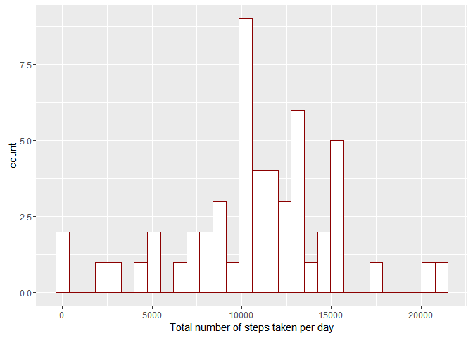
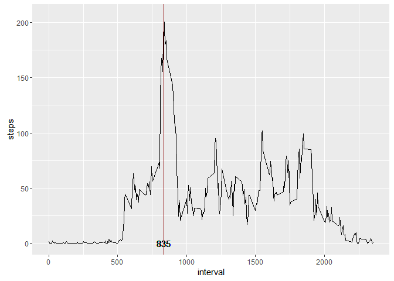
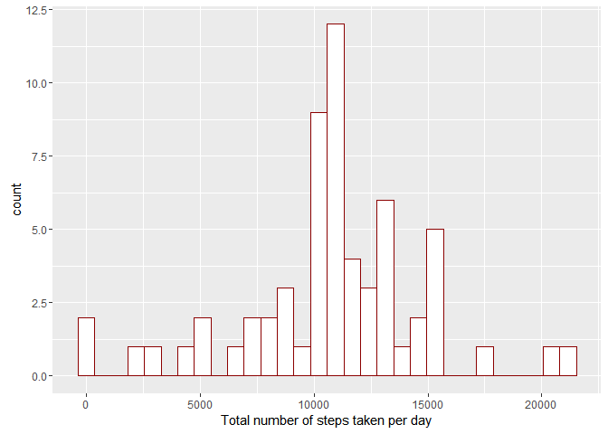
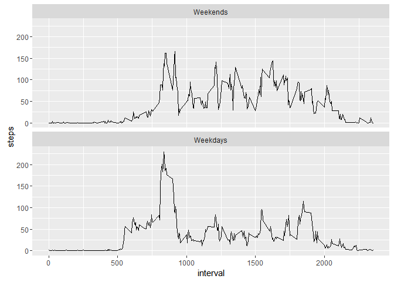

# Reproducible Research: Peer Assessment 1


## Loading and preprocessing the data
First, let's load the data and the libraries we need.
In this assignment I use ggplot2 and dplyr. These tools are very helpful in exploratory data research.

After these steps let's make a first look:


```r
library(dplyr) #for comfortable work with data
df <- read.csv("activity.csv",stringsAsFactors = F, header = T)
head(df)
```

```
##   steps       date interval
## 1    NA 2012-10-01        0
## 2    NA 2012-10-01        5
## 3    NA 2012-10-01       10
## 4    NA 2012-10-01       15
## 5    NA 2012-10-01       20
## 6    NA 2012-10-01       25
```

```r
dim(df)
```

```
## [1] 17568     3
```

```r
class(df$date)
```

```
## [1] "character"
```

We see:

- there are 17568 rows in data frame;
- the variable 'date' has class 'character';
- there are a lot of NAs in varible 'steps'

Converting to 'date' to class 'Date':


```r
df$date <- as.Date(df$date, format = "%Y-%m-%d")
class(df$date)
```

```
## [1] "Date"
```

## What is mean total number of steps taken per day?

**Calculation of the total number of steps taken per day**

First, I made a vector containing total number of steps taken per day

```r
total_steps <- as.numeric(tapply(df$steps, df$date, sum))
```

**After this, I plot a histogram**


```r
library(ggplot2)
qplot(total_steps, 
      geom = "histogram", 
      fill = I("white"), 
      colour = I("darkred"), 
      xlab = "Total number of steps taken per day") 
```

```
## `stat_bin()` using `bins = 30`. Pick better value with `binwidth`.
```

```
## Warning: Removed 8 rows containing non-finite values (stat_bin).
```

<!-- -->

**Calculation of mean and the median**

The mean:

```r
mean(as.integer(tapply(df$steps, df$date, sum)), na.rm = T)
```

```
## [1] 10766.19
```
The median:

```r
median(as.integer(tapply(df$steps, df$date, sum)), na.rm = T)
```

```
## [1] 10765
```

## What is the average daily activity pattern?

*The picture below is time series plot (i.e. type = "l") of the 5-minute interval (x-axis) and the average number of steps taken, averaged across all days (y-axis). The maximum value is shown by red line.*


```r
means <- as.integer(tapply(df$steps, df$interval, function(x) mean(x, na.rm = TRUE))) 
head(means)
```

```
## [1] 1 0 0 0 0 2
```

```r
##Vector containing averaged across all days number of steps taken
day_interval <- unique(df$interval)[which.max(means)] #Day interval with max value

plot1 <- ggplot(data = df, aes(interval, steps))
plot1 + stat_summary(fun.y = "mean", geom = "line") + 
        geom_vline(xintercept = day_interval, colour = "darkred") +
        geom_text(aes(day_interval, 0 , label = day_interval))
```

<!-- -->

**The interval with maximum number of steps taken is 835**

## Imputing missing values

The number of missing values:

```
## [1] 2304
```

For missing values I used the mean for every interval:


```r
for (i in 1:nrow(df)){
        if (is.na(df$steps[i])==TRUE) 
        {df$steps[i]=mean(df$steps[df$interval == df$interval[i]], 
                                  na.rm = TRUE)}
}
head(df)
```

```
##       steps       date interval
## 1 1.7169811 2012-10-01        0
## 2 0.3396226 2012-10-01        5
## 3 0.1320755 2012-10-01       10
## 4 0.1509434 2012-10-01       15
## 5 0.0754717 2012-10-01       20
## 6 2.0943396 2012-10-01       25
```


```r
total_steps <- as.numeric(tapply(df$steps, df$date, sum))
qplot(total_steps, 
      geom = "histogram", 
      fill = I("white"), 
      colour = I("darkred"), 
      xlab = "Total number of steps taken per day")
```

```
## `stat_bin()` using `bins = 30`. Pick better value with `binwidth`.
```

<!-- -->

The mean:

```r
mean(as.integer(tapply(df$steps, df$date, sum)))
```

```
## [1] 10766.16
```
The median:

```r
median(as.integer(tapply(df$steps, df$date, sum)))
```

```
## [1] 10766
```

As we can see there's no big differences between estimates in the 1st part of assignment

## Are there differences in activity patterns between weekdays and weekends?

To avoid Russian letters I changed my local time to US


```r
Sys.setlocale("LC_TIME", "US")
```

```
## [1] "English_United States.1252"
```

Then I created a new factor variable (actually I made bit changes in var 'date') in the dataset with two levels – “weekday” and “weekend” indicating whether a given date is a weekday or weekend day.


```r
w_ends <- c("Saturday", "Sunday")
df$date <- factor(weekdays(df$date) %in% w_ends, 
                  levels=c(TRUE, FALSE), 
                  labels = c("Weekends", "Weekdays"))
str(df)
```

```
## 'data.frame':	17568 obs. of  3 variables:
##  $ steps   : num  1.717 0.3396 0.1321 0.1509 0.0755 ...
##  $ date    : Factor w/ 2 levels "Weekends","Weekdays": 2 2 2 2 2 2 2 2 2 2 ...
##  $ interval: int  0 5 10 15 20 25 30 35 40 45 ...
```

Finally I made a panel plot containing a time series plot (i.e. type = "l") of the 5-minute interval (x-axis) and the average number of steps taken, averaged across all weekday days or weekend days (y-axis).


```r
library(ggplot2)
g <- ggplot(data = df, aes(interval, steps))
g + stat_summary(fun.y = "mean", geom = "line") + facet_wrap(~date, nrow = 2)
```

<!-- -->

As we can see the people make more steps during the weekend.
